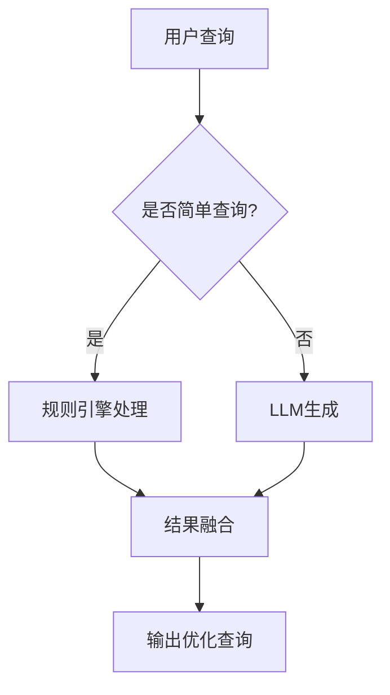

### **一、Query ReWriter 的定义与作用**
**Query ReWriter** 是一种自然语言处理（NLP）组件，用于将用户输入的原始查询（通常为口语化、模糊或不完整）转换为 **结构化、明确且适合下游任务** 的优化查询。  
**核心目标**：  
- 提升检索系统的召回率（Recall）和准确率（Precision）  
- 适配特定领域术语（如医疗、法律）  
- 消除歧义（如代词指代、多义词）  

**示例**：  
- 输入：`"西藏有啥好玩的？"`  
- 输出：`"列出西藏旅游景点，包括布达拉宫、纳木错等，并附上简介和门票价格"`

---

### **二、核心技术实现**
#### **1. 主流技术方案**
| **方法**               | **原理**                              | **优缺点**                          | **适用场景**              |
|------------------------|---------------------------------------|-------------------------------------|---------------------------|
| **规则引擎**           | 基于正则表达式和模板匹配              | ✅ 速度快，可解释性强<br>❌ 泛化能力差 | 固定句式（如客服场景）    |
| **微调语言模型**       | 使用领域数据微调T5/BERT等模型         | ✅ 语义理解强<br>❌ 需训练数据       | 专业领域（医疗、金融）    |
| **LLM即时生成**        | 调用GPT-4/Claude等大模型API           | ✅ 零样本能力强<br>❌ 成本高、延迟大 | 开放域复杂查询            |
| **混合模式**           | 规则兜底 + 模型生成                   | ✅ 平衡速度与质量<br>❌ 实现复杂      | 企业级生产环境            |

#### **2. 典型模型选型**
- **轻量级**（本地部署）：  
  - **T5-Small**（60M参数，适合移动端）  
  - **Phi-3-mini**（3.8B参数，低资源优化）  
- **高性能**：  
  - **Mistral-7B**（7B参数，通用场景）  
  - **Llama-3-8B**（多语言支持）  

#### **3. 代码实现示例（基于T5）**
```python
from transformers import T5ForConditionalGeneration, T5Tokenizer

model = T5ForConditionalGeneration.from_pretrained("t5-small")
tokenizer = T5Tokenizer.from_pretrained("t5-small")

def rewrite_query(query: str) -> str:
    input_text = f"rewrite for clarity: {query}"
    inputs = tokenizer(input_text, return_tensors="pt")
    outputs = model.generate(**inputs, max_length=50)
    return tokenizer.decode(outputs[0], skip_special_tokens=True)

# 示例
print(rewrite_query("西藏的照片"))  # 输出: "展示西藏旅游景点的摄影图片"
```

---

### **三、核心应用场景**
#### **1. 搜索引擎优化**
- **问题**：用户搜索 `"便宜西藏游"`  
- **改写**：`"2024年西藏跟团游低价套餐，含机票和酒店"`  
- **效果**：提升广告系统和推荐结果的匹配度  

#### **2. 企业知识库问答**
- **问题**：`"报销流程是啥？"`  
- **改写**：`"简述员工差旅费用报销的具体步骤和所需材料"`  
- **效果**：精准匹配HR文档中的条款  

#### **3. 多模态检索**
- **问题**：`"找那个山景图"`  
- **改写**：`"检索包含雪山、蓝天的高清风景照片，拍摄地为西藏"`  
- **效果**：提升图像数据库的检索准确率  

---

### **四、性能优化策略**
#### **1. 延迟优化**
- **量化模型**：将模型转换为GGUF格式（如Q4_K_M量化）  
  ```bash
  python convert.py --input-model t5-small --output-gguf t5-small-q4.gguf --quantize q4_k_m
  ```
- **缓存结果**：对高频查询使用LRU缓存  
  ```python
  from functools import lru_cache
  @lru_cache(maxsize=1000)
  def cached_rewrite(query): ...
  ```

#### **2. 质量提升**
- **领域适配**：注入领域术语词典  
  ```python
  MEDICAL_TERMS = {"心口疼": "心绞痛", "拉肚子": "腹泻"}
  def expand_terms(query): ...  # 替换口语词
  ```
- **反馈学习**：记录用户点击数据优化模型  

#### **3. 混合架构设计**


---

### **五、评估指标**
| **指标**          | **计算方法**                          | **目标值** |
|--------------------|---------------------------------------|------------|
| **语义一致性**    | 人工评估改写前后意图匹配度（0-5分）   | ≥4.5       |
| **术语准确率**    | 领域关键词保留率                      | ≥95%       |
| **响应延迟**      | P99延迟（GPU/CPU）                    | <300ms     |
| **检索效果提升**  | 对比原始查询的召回率提升              | +20%       |

---

### **六、开源工具推荐**
1. **HuggingFace Transformers**：快速部署T5/BERT改写模型  
2. **llama.cpp**：本地运行量化版LLM（如Mistral-7B）  
3. **LangChain Tools**：集成多工具调用（如搜索+改写）  

---

### **七、挑战与解决方案**
| **挑战**  | **解决方案**            |
| ------- | ------------------- |
| 代词指代模糊  | 结合对话历史生成上下文感知的查询    |
| 领域术语缺失  | 构建领域词表并注入提示词        |
| 多语言混合查询 | 使用mT5或Llama-3等多语言模型 |
| 实时性要求高  | 预加载模型+异步处理          |
|         |                     |

### 扩展学习资源

1. [Query Rewriting Paper List](https://github.com/thunlp/PromptPapers#query-rewriting) - 清华大学整理的论文列表    
2. [TREC Query Reformulation Dataset](https://trec.nist.gov/data.html) - 标准测试数据集    

实际开发时建议结合业务需求选择适合的改写策略，并通过A/B测试验证效果。

---

通过合理选择技术方案和优化策略，Query ReWriter 可显著提升搜索系统、对话Agent和数据检索管道的效果。建议从 **轻量级规则引擎** 开始验证需求，逐步过渡到 **微调模型+LLM混合架构** 以实现最佳平衡。

